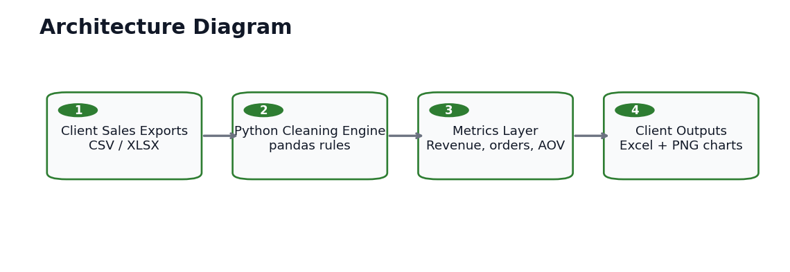
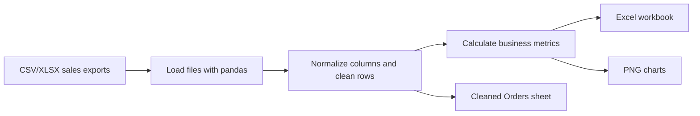

# Architecture Diagram

## Components

| Layer | Responsibility |
| --- | --- |
| Client exports | Raw CSV/XLSX files from POS, ecommerce, inventory, or accounting tools |
| Cleaning engine | Loads files, standardizes columns, fills common missing values, and removes duplicate orders |
| Metrics layer | Calculates revenue, order count, average order value, top products, and monthly revenue |
| Output layer | Produces an Excel workbook, PNG charts, and a local run log |

## Data Flow

## Client Notes

The architecture is intentionally batch-oriented so a client can drop new exports into `sample_data/` and rerun the same command for a fresh report.
