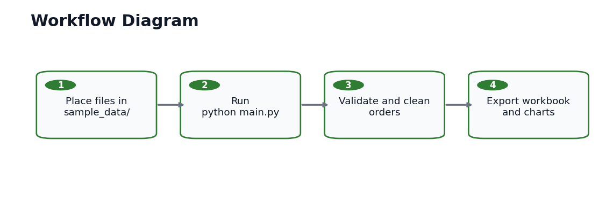

# Workflow Diagram



## Operator Workflow

1. Place raw sales exports in `sample_data/`.
2. Run `python main.py`.
3. The script validates, cleans, and standardizes the order rows.
4. The script exports the Excel report and chart images to `output/`.

## Command

```powershell
python main.py --input-dir "sample_data" --output-dir "output"
```

## Handoff Checklist

- Confirm input files are CSV, XLSX, or XLS.
- Review `output/summary_report.xlsx`.
- Attach chart PNG files to the client report or proposal.
- Keep `output/run.log` local for troubleshooting.
